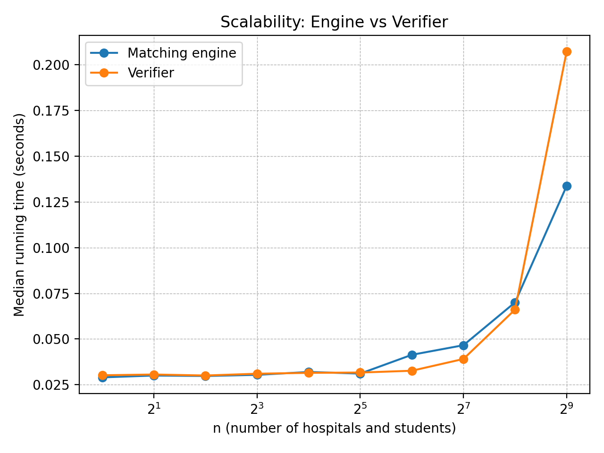

# COP4533 Programming Assignment 1: Stable Matching

## Team Members
- Taebok Joseph Kim - 13744367
- Manas Adepu - 67807126

## Overview
Implementation of the Gale-Shapley algorithm for the hospital-student stable matching problem.

## Project Structure
```
src/       - Source code (matcher, verifier)
data/      - Example input/output files (example.in example.out matching is valid and stable)
results/   - Benchmark results and graphs
```

## Requirements
- Python 3.7+

### Running the Matcher
The matcher implements the hospital-proposing Gale-Shapley algorithm.

From the `src/` directory:
```bash
python matcher.py example.in
```

**You do not need to provide the full path for an input file, matcher.py automatically assumes the data directory!**

### Running the Verifier
The verifier checks if a matching is valid and stable.

From the `src/` directory:
```bash
python verifier.py example.in example.out
```

**You do not need to provide the full path for an input/output file, verifier.py automatically assumes the data directory!**

## Assumptions

### Input Format
- First line contains a single integer `n` (number of hospitals and students)
- Next `n` lines: hospital preference lists (each is a permutation of 1 to n)
- Next `n` lines: student preference lists (each is a permutation of 1 to n)
- All IDs are **1-indexed** in input/output files
- Preferences are **complete** (each entity ranks all others) and **strict** (no ties)

### Output Format
- Matcher outputs `n` lines, each containing `hospital_id student_id`
- Verifier outputs `VALID STABLE`, `VALID but UNSTABLE`, or `INVALID` with details

### Dependencies
- Python 3.7+ (no external libraries required, uses only standard library)

## Task C: Scalability Analysis

We measured the running time of both the matcher and verifier for n = 1, 2, 4, 8, 16, 32, 64, 128, 256, 512 hospitals/students.



### Observations

- For small inputs (n ≤ 32), both algorithms run almost instantaneously with negligible time differences.
- After n = 32, the running time increases noticeably for both the matcher and verifier.
- The verifier has a higher median running time than the matcher for larger inputs. This is expected because the verifier checks all n² possible (hospital, student) pairs for blocking pairs, resulting in O(n²) complexity for the stability check.
- The matcher (Gale-Shapley) has O(n²) worst-case complexity since each hospital can propose to at most n students, and there are n hospitals.

### Implementation Note

We used Python for this implementation, which has higher constant factors compared to compiled languages like C or Java. The relative performance trends remain consistent with the theoretical O(n²) complexity for both algorithms.
